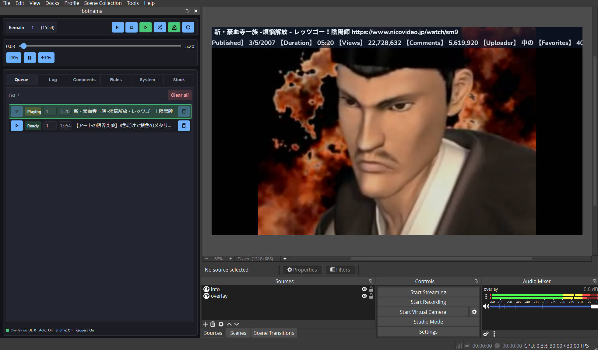

English | [日本語](README_ja.md)

<h1 align="center">botnama</h1>
<br>
<p align="center">
   
</p>

**botnama** is an OBS-integrated media bot that extracts video URLs from live stream comments (YouTube, Niconico Live, etc.), automatically downloads and plays requested videos. It seamlessly queues and plays requested videos during live streams.

<p align="center">
   
</p>

## Key Features

- **Automatic URL Detection** — Detects URLs and plain-text identifiers in comments (e.g., `sm12345`, `BV…`) and normalizes them for playback (YouTube: `watch?v=VIDEOID`, `youtu.be/VIDEOID`, `shorts/ID`; Niconico: `sm`/`nm`/`so` IDs; Bilibili: `BV` IDs).
- **Auto Download & Cache** — Automatically fetches and converts videos using `yt-dlp` and `ffmpeg`
- **OBS Integration** — Integrates with OBS via browser dock (management interface) and browser source (playback overlay)
- **Playback Control** — Supports stop, skip, seek, and other operations
- **Notifications** — Displays events (requests, playback, etc.) and video information on screen or via comments
- **Authentication Integration** — Supports browser cookie extraction for YouTube / Niconico
- **Flexible Rule Settings** — Video length limits, duplicate control, NG users, voting features
- **Multi-language Support** — Japanese/English UI switching (`locale` setting)
- **MultiCommentViewer Plugin** — Receive comments from various streaming platforms via MCV

## Quick Start

### Download from GitHub Release

1. **Download the Latest Release**

   Download the latest `botnama.exe` from the [Releases page](https://github.com/zkamiyama/botnama/releases).

2. **Place in Any Folder**

   Place `botnama.exe` in any folder. On first launch, directories like `config/`, `db/`, `cache/`, `bin/` will be automatically created in the same folder. yt-dlp and ffmpeg will be downloaded automatically, but if this fails, place them manually in the `bin/` directory.


3. **Run**

   Double-click `botnama.exe` to start. A command prompt will open and the server will start.

4. **Verify in Browser**

   Open `http://localhost:2101/dock/` in your browser to access the management interface.

5. **Register in OBS**

   Refer to the "Using with OBS" section below to register browser dock and browser source in OBS.

## Using with OBS

### Register Dock (Management Interface)

1. OBS → **View** → **Docks** → **Custom Browser Docks**
2. Configure:
   - **Dock Name**: `botnama Dock`
   - **URL**: `http://localhost:2101/dock/`

### Register Overlay (Playback Screen)

1. OBS → **Sources** → **Browser**
2. Configure:
   - **URL**: `http://localhost:2101/overlay/`
   - **Width** / **Height**: Set to match your stream resolution (e.g., 1920x1080)
3. Configure audio to output to OBS mixer

### Integrate with YouTube / Niconico Live

botnama can integrate with YouTube and Niconico Live by registering browser cookies.

#### What You Can Do by Registering Cookies

- **Auto Stream URL Detection** — Automatically detects your stream URL and receives comments via the built-in comment viewer
- **Auto Comment Sending** — Automatically sends video information as comments
- **Age-Restricted Videos** — Play age-restricted videos
- **High Quality Playback** — Some sites only allow high-quality playback when logged in

**Note**: If the built-in comment viewer doesn't work properly or if you want more reliable comment reception, refer to the "MultiCommentViewer Integration" section below and use the MCV plugin.

#### Cookie Registration Steps

1. **Log in to YouTube / Niconico in Browser**

   Log in to YouTube or Niconico in your browser.   
   **Recommended Browser**: Firefox is recommended. Chrome may fail to extract cookies due to security features.

2. **Edit botnama Settings**

   Open `config/settings.toml` and add the following configuration:

   ```toml
   ytDlpCookiesFromBrowser = "firefox"  # or "chrome"
   ytDlpCookiesFromBrowserProfile = "default"  # Profile name (usually "default")
   ```

   **Reference: Browser Cookie Storage Locations on Windows**:
   - **Firefox**: `C:\Users\<username>\AppData\Roaming\Mozilla\Firefox\Profiles\<profile-name>\cookies.sqlite`
   - **Chrome**: `C:\Users\<username>\AppData\Local\Google\Chrome\User Data\<profile-name>\Network\Cookies`


3. **Restart botnama**

   After saving the settings, restart botnama. Browser cookies will now be loaded automatically.

4. **Verify**

   Click the "Refresh Auth" button in the System tab of the Dock to verify that cookies are being loaded correctly.

### Register Info Overlay (Notification Screen)

1. OBS → **Sources** → **Browser**
2. Configure:
   - **URL**: `http://localhost:2101/overlay-info/`
   - **Width** / **Height**: Set to match notification banner size
3. Events like requests, playback, skip, etc. will be displayed on screen

## Configuration Customization

### `config/settings.toml`

- **`httpPort`** — Server port number (default: `2101`)
- **`cacheDir`** — Video cache directory (default: `cache/videos`)
- **`ffmpegPath`** — ffmpeg executable path (default: `bin/ffmpeg`)
- **`ytDlpPath`** — yt-dlp executable path (default: `bin/yt-dlp`)
- **`locale`** — UI language (`ja` / `en` / `auto`)

## MultiCommentViewer Integration

1. **Place plugin**

- Copy the `plugins/botnama` directory into the MultiCommentViewer `plugins/` directory

**Download / Repository**: [MultiCommentViewer Releases](https://github.com/DaisukeDaisuke/MultiCommentViewer/releases)

2. **Configuration (Optional)**

- **botnama side**: Set any value for `mcvAccessToken` in `config/settings.toml`
- **MCV side**: Enter the same value in the "Shared Token" field in the plugin settings screen

## Rules Configuration

You can configure detailed rules for video requests in the **Rules** tab of the Dock (management interface).

- **Video Length Limit**: Restrict videos with long playback time
- **Duplicate Control**: Prevent consecutive requests for the same video
- **Concurrent Request Limit**: Set request interval per user
- **NG Users**: Reject requests from specific users
- **Poll**: Decide whether to continue playing requested videos by viewer voting

### Custom Site Settings

You can add URLs from sites other than YouTube / Niconico / Bilibili to the detection targets.

## Development

- **Deno 2.x** — Install from [official site](https://deno.land/)
- **.NET SDK** (optional) — Required if building MCV plugin

### Setup

1. **Clone Repository**

```bash
git clone https://github.com/zkamiyama/botnama
cd botnama
```

2. **Run Initial Setup**

```bash
deno task setup
```

- Initializes submodule (`external/MultiCommentViewer`)
- Places `mediabunny`
- Builds MCV plugin (if .NET SDK is installed)


3. **Start Development Server**

```bash
deno task dev
```

- Open the following URLs in your browser to verify:
  - **Management Interface (Dock)**: `http://localhost:2101/dock/`
  - **Playback Overlay**: `http://localhost:2101/overlay/`
  - **Notification Overlay (Info Overlay)**: `http://localhost:2101/overlay-info/`

## Common Tasks

### Create Release Build

```bash
deno task release
```

- `release/botnama.exe` (Windows) will be generated
- Can be distributed as a portable executable

## Documentation

- **API Documentation** — See [docs/API.md](docs/API.md)

## Acknowledgements

- **[yt-dlp](https://github.com/yt-dlp/yt-dlp)**
- **[ffmpeg](https://ffmpeg.org/)**
- **[MultiCommentViewer](https://github.com/DaisukeDaisuke/MultiCommentViewer)**
- **[mediabunny](https://github.com/Vanilagy/mediabunny)**
- **[ボトル/bobineKS](https://x.com/bobine_ks)**

---
